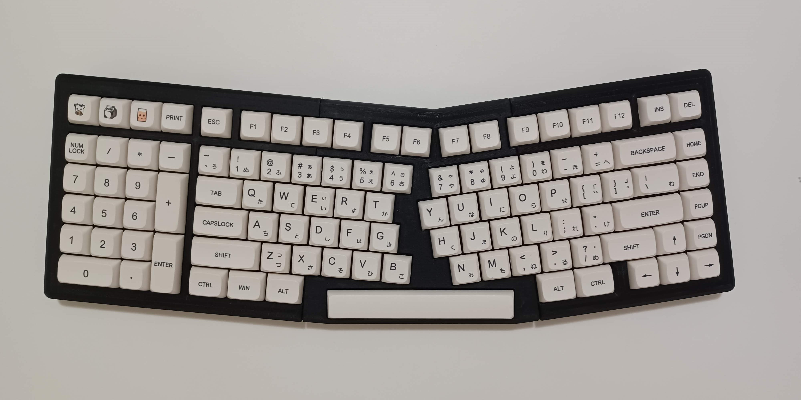

# KMK-Mechanical-Keyboard
A 3D Printed, Ergonomic, Southpaw, 96% Mechanical Keyboard using the KMK Firmware for the Raspberry Pi Pico.

Details:
- 6° Angle on both sides
- 5° Tilt
- 103 Keys
    - Includes Mute, Volume Down, and Volume Up keys.
- Compatible with all MX keycap sets that support both 75% and Full Size layouts.

Materials Needed:
- 103 MX Mechanical Switches
- 103 1N4148 Diodes
- 103 MX Hotswap Sockets
- 75% keycap set + Numpad
    - Specfically, any keycap set with a numpad and a 1.75u right shift key.
    - I used the Milk Honey keycap set from Amazon.
- A Full-Size set of Plate-Mounted Stabilizers
    - 7 x 2u stabilizers and 1 x 6.25u stabilizer
    - My build also lubricated and Band-Aid modded the stabilizers. 
- 10 M2.5 x 12mm screws
    - Optionally, you can also screw these into 10 M2.5 threaded inserts.
- 4 M2 x 4mm screws
- 300-400 ft. of wire.
- Superglue

Tools Needed:
- 3D printer
    - Must have a build plate of at least 220mm x 220mm
- Soldering iron (and associated tools, like solder, flux, etc.)

## Firmware
Install using this [KMK firmware guide](https://github.com/KMKfw/kmk_firmware/blob/main/docs/en/Getting_Started.md).

The [boot.py](firmware/boot.py) and [code.py](firmware/code.py) files are provided under the `/firmware` directory
- The boot.py file used was from [jpconstantineau's VColChoc44 repository](https://github.com/jpconstantineau/VColChoc44). However, it can no longer be found there, so a copy of it is provided in this repository.

code.py:
- The keyboard.keymap is reversed from how it should appear. This is because the keyboard is flipped while wiring from the back, so reversing the keymap makes the wiring less confusing.
- This also means that the keyboard.col_pins are ordered from right to left when viewed normally.
- Since the wiring guide photo was also taken from the back, the keymap matches it properly.

## Printing
In order to reduce the resonance of the keyboard and increase its weight some alternative print settings were used:
- 0 top layers
- 5% grid infill at double line thickness
- 4 perimeters
Then the prints were backfilled with silicone sealant. However, this is unecessary and complicates the build, so it's optional.

This should be printed at 4 perimeters for strength, but fewer can be used if the top layers are being printed.

The parts were sanded along the joints and superglued together.

Some test prints may need to be done to hone the tolerances before fully committing to printing the rest of the keyboard. The .stl files may also have to be reoriented before printing, as none of the parts should need supports.

## Wiring Guide

- There is no specific technique used to wire the keyboard. Any can be used as long as the wiring fits when the keyboard is screwed together
- The diodes are wired from column to row

If the rows or columns are wired to the wrong pins, either rewire it so that it matches the guide, or change the code.py file to match the new wiring.