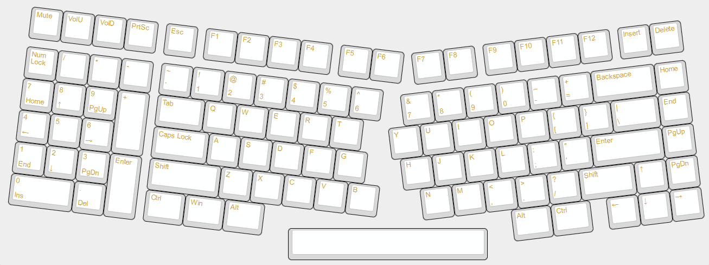

# KMK-Mechanical-Keyboard
This file serves to document my process in making my first mechanical keyboard for future reference when I inevitably build another one.

# 1. Making the Layout
## Requirements
The layout I would design had certain specifications for my use case. I needed:
1. A function row
2. A numpad
3. Insert and Delete Keys
4. Volume keys
5. Print screen key
6. The total width of the keyboard had to be as long as or shorter then a traditional full-size keyboard.
7. The cost of the keyboard should be ~$100.

In addition, I had other requirements that I simply wanted:
* The numpad will be left-handed. I wanted to find out whether not having to move my hand between the mouse and numpad when typing into spreadsheets would increase productivity.
  * This had a secondary purpose of centering the main keys; The numpad will be on the left whereas the mouse will be on the right. Normally both are on the right side, so main keys are shifted left, messing with ergonomics.
* The keybard will be ergonomic with a split down the center of the home row of the keyboard.
* The keyboard will have hot-swappable switches.
* The keyboard will sound "nice"

These requirements were chosen so that I would make a keyboard layout which does not yet exist on the market. It served as justification for why I had to handwire one and not just go out and build a normal keyboard.

## Problems
With the budget set in mind, the microcontroller was already decided for me; it would be the Raspberry Pi Pico. At only $4, there was no other micro controller that could approach its price while providing as many GPIO pins that it has. Even though it came with 26 GPIO pins, it was still one pin short of making a traditional full-size keyboard layout, which needed 27. This meant that I had to find a way to reduce the number of columns my keyboard had by one in order to meet the pin requirement.

The budget also meant that my keyboard layout should use as many standard keys as possible. Any exotic keyshapes meant a more expensive keycap set to accomodate them. Since I wanted a split keyboard, my layout could not be a standard Alice layout, since its split space bar and two 'B' keys was hard to find among the cheapest keycap sets. It also had the characteristic of making any keyboard using its layout a lot longer, which wouldn't work well with my length requirement.

Another problem is that I expect this keyboard to be quite thick because handwiring is generally thicker than a pcb, so reducing the thickness as much as possible will be a challenge. I also have to consider where to put the Pi Pico so as to not increase thickness too much.

With these considerations, I went on to making my keyboard layout.

## Layout
My layout was designed on the aptly-named website [Keyboard Layout Editor](http://www.keyboard-layout-editor.com/). This will allow me to experiment with as many layouts as I can digitally before I commit to one physically. At the same time as making the layouts, I was also considering the parts I would have to get and how I would have to design the case in order to make the layout possible.

This was the final iteration of my layout. I have tried to keep as many standard keys as possible, however with the strict GPIO pin limitation, some compromises had to be made. 

First was the the 1.75u shift. Reducing the pin count meant pushing the arrow keys, home, end, page up, and page down keys into the main portion of the other keys instead of being separate like they usually are. These changes will now require more unique keycap sets that may cost more. Though, this was a sacrifice I was willing to take, as finding a larger microcontroller within budget or trying to make the wiring work within 26 pins would cost a lot more money and time than to simply find a different keycap set. Nowadays, there is also a growing number of inexpensive keycap sets fit for many layouts, so I expect this change will have little impact in the future if I need to get multiple keycap sets.

What couldn't be compromised however, was the spacebar. Technically, the Alice layout has a split spacebar, and keycap sets are also starting to accomodate split spaces, but it is impossible to find a single stabilizer set that replaces the spacerbar stabilizer for two smaller ones, so my layout cannot split the spacebar. Additionally the size of the spacebar means that I cannot create a large angle between the two halves of the keyboard without making the spacebar too far away from the thumb. The final angle I decided upon was 7° on both sides.

For the most part, this layout is just a 75% with an extra numpad on the left and a crack in the middle. Three is also the volume keys I wanted, as well as a Print Screen since I had space for an extra key.

# 2. Finding Parts
After watching many handwired keyboard videos, I have determined the minimum list of parts that I need:
1. micro-controller (which has already been decided as a Pi Pico)
2. 103 switches (based on the intended keyset)
3. at least 103 1N4148 diodes
4. 7 plate-mount stabilizers (6 2u, and 1 6.25u)
5. keycaps (with a 1.75u shift and at least 3 spare keys for volume)
6. solid-core copper wire (at least 10ft) and stranded-core copper wire (20-25ft)
7. Any extra tools needed to build the keyboard

These parts are mostly agnostic to keyboard layout, so the parts list can be considered before or at the same time as the keyboard layout design. Most of these parts were be bought on Amazon for meet their free shipping purchase requirement. 

The most important part of the keyboard is the switch, which can also be the most expensive part. This was especially true since I would be sourcing 103 switches. Therefore, my first order of business was to find the best value switch availabe on the market. Sound quality was an initial consideration, but I eventually dismissed it since it wasn't a priority, and finding good switches was a role better suited to a future keyboard design. I decided upon the Outemu Silent Peach V3 switches. They were silent, so I didn't need to worry about the accoustic properties of a 3d printed keyboard. They also came as a set of 110 at $22, or 20¢ per switch

Every single switch needs a diode so that the keyboard can support [n-key rollover](https://en.wikipedia.org/wiki/Key_rollover). All of the videos I have seen have used 1N4148 diodes. I don't know why, but there's no reason to start experimenting with others here. It's also only $5 for 125 on Amazon, which seems like a fair price.

Since my keyboard won't have a pcb, I couldn't buy pcb-mounted stabilizers, which are usually more secure. Instead, my only option are plate-mounted stabilizers, which are prone to popping out when being tossed around. Luckily, I don't intend on bringing my keyboard anywhere, so plate-mount should be just fine. In terms of stabilizer quality, there are many options that I think are unnecessarily expensive, as a few simple mods can make most pairs of stabilizers silent (which is the goal, you shouldn't ever hear stabilizer rattle). I chose the Epomaker Plate-Mounted Stabilizers on Amazon because they came with 7 stabilizers, some lubricant, and a brush all in one for $8. Lube is essential for silencing stabilizers, and I wouldn't have to pay extra for it.

My layout will need a 1.75U shift, which isn't a standard key, but it is common enough among keycap sets that it shouldn't be a big problem. Especially for mechanical keyboards, keycap sets usually come with many extra keys to support lots of configurations because recently 65% boards have become quite popular (which uses a 1.75u shift). I also wanted keycaps with a 1.5mm wall thickness. It's pretty clear the sound benefits of using thick keycaps instead of thin ones, and the chances are a thick keycap set also accomodates many configurations, so it shouldn't be hard to find. I settled on the Honey Milk keycap set on Amazon for $18, since it was the cheapest set that fufilled my needs. In hindsight, I hate its looks and would much prefer to spend a little extra on a better looking set. Since the keycaps are the main contributor towards the overall look of a keyboard, my keyboard lost a lot of style points.

Next is copper wire. I tore down two ethernet cables to get it, one with solid core wire and another with stranded core. You should still be able to wire your keyboard if you only had one of the types. Ideally, that type would be solid core since it's easier to work with. Tearing down one cable should provide more than enough wire for multiple keyboards.

To build the keyboard will also need extra parts. I couldn't predict them in advance, so I just bought what I needed as I needed them. The final list of things I *actually* used were:
1. Wire strippers
2. Mechanical switch puller
3. Keycap puller (most keycap sets come with one, like mine)
4. 3d printer and filament (this is expensive, but it's assumed that you already have this if you are pursuing this project)
5. Silicone caulk (not necessary)
6. 3 M2 screws and 10 M2.5 screws, nuts and scredriver
7. Sandpaper
8. Superglue
9. Masking tape
10. 1 Band-Aid
11. Soldering station, solder, flux, etc. (it is also assumed that you have this as well)

# 3. Designing the Keyboard (Part 1)
There are many different ways to construct a keyboard case, but I have chosen to use the [sandwich mount](https://www.keyboard.university/200-courses/keyboard-mounting-styles-4lpp7). This is because the plate, top case, and bottom cases will be easier to print as their own separate parts, and because it will reduce the number of screws that will need to hold everything together.

## The Plate
The layout from the Keyboard Layout Editor will be used for making the plate by using the website [swillkb](http://builder.swillkb.com/). It takes a given keyboard layout and outputs a .svg vector file with all the switch and stabilizer holes cut out.

The specific settings were:
- The basic retangular MX switch type holes
- Cherry + Costar stabilizer cutouts
- 15mm bottom edge padding (edge padding must be turned on first). This is needed because the layout is too wide and the spacebar is cut out.

I clicked "Draw My CAD!!!" to finish the file and download the svg in the "CAD Output" tab.

I then imported the file into [Inkscape](https://inkscape.org/), an open source vector software, to edit the svg.